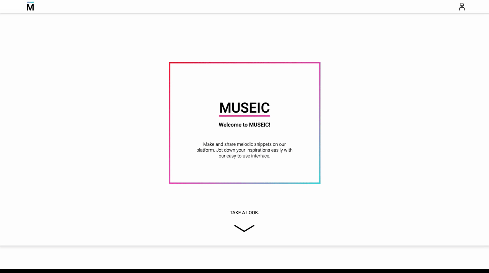
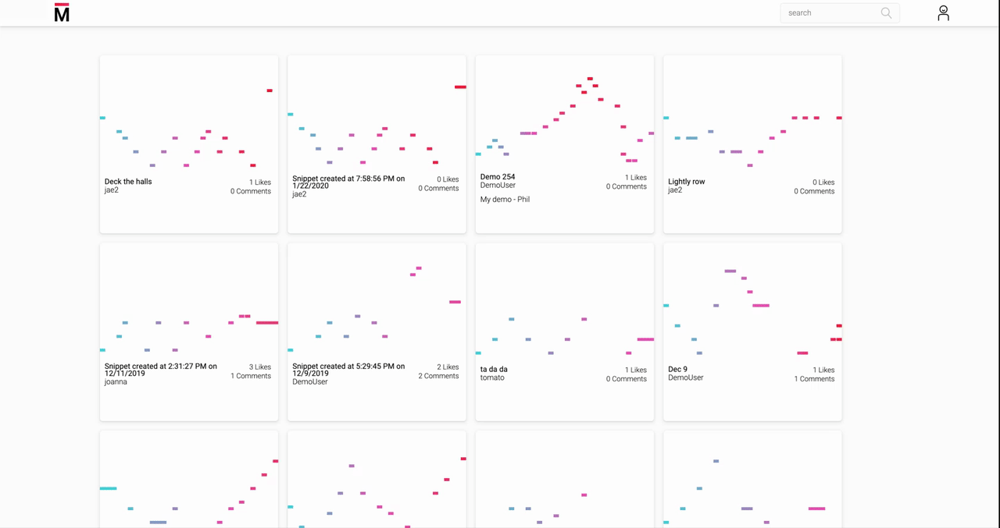
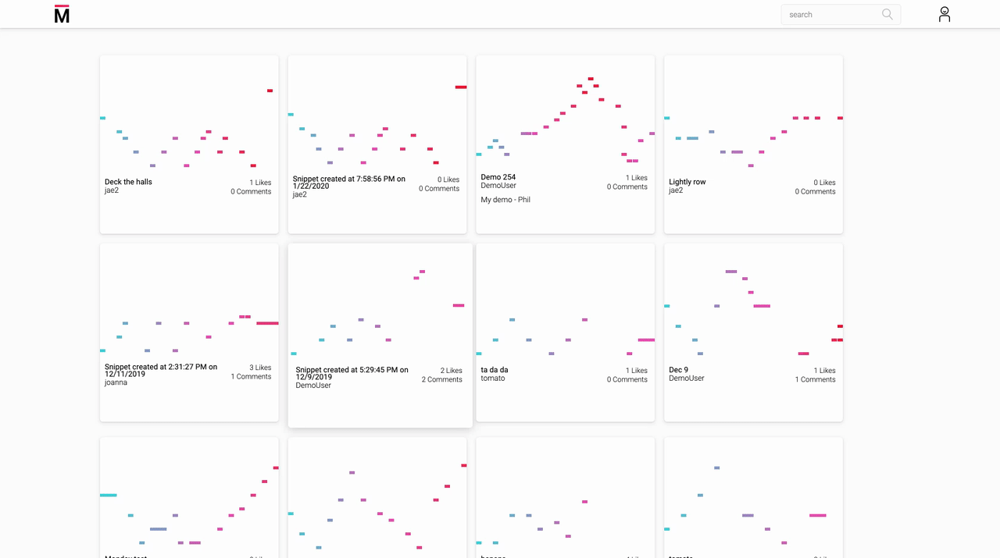
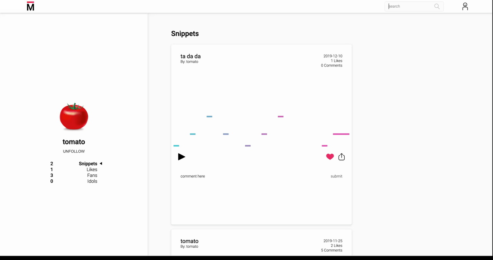
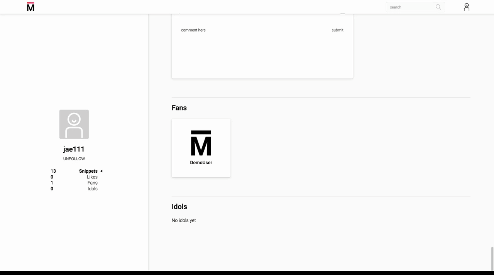

# Museic
### [Live Demo](http://museic-demo.herokuapp.com/#/ "Live link of Museic")

## Summary: A MERN-stack single-page web application that allows users to make, and share short, musical snippets.

**Technologies used:**
MongoDB, Express, React / Redux, Node JS (MERN stack)

**Developers:**
Jenny / Jiani Fan, Jaehyuk Lee, Phil Zheng

## Key features:
* Interactive splash tutorial page
* Musical component
* Accessible create element in nav
* Elegant snippet index/ show page
* Front-end relational database queries on top of noSQL 
* AWS S3 image hosting

## Interactive Splash

Our splash page walks new users through a curated journey from intro to creating an account. 
The steps are as follows:
1. Captivating animated name, and description of app.
2. Demonstration of what you can make on the app.
3. Having users create their own snippet, while learning how to use the musical component.
4. Asking for users to make an account with the incentive of saving their snippet.
5. The developers credit area.

## Musical Component

The input component is an octave of piano keys on the screen. It leverages Web Audio API and custom event listeners on each key to produce sound with the corresponding pitch for the duration of the mouse click.

The event listeners are also used to "record" user input (snippets) by keeping track of each individual input's pitch, relative start time, and duration. Then the snippet is saved directly into the database as an array of musical note objects, each with those three pieces of information. This way, the "playback" of a snippet can be achieved by reproducing the sounds using only Web Audio API. This method eliminates the need for cloud storage of audio files.

The input component is paired with a display component that dynamically creates  visual representations of user input notes in real-time.

## Accessible Create

We designed our app to have little between the user and the “create page”, by putting the create element in the navbar.
The nav is on every “page” when users are logged in.
Users don’t have to leave their current page to make a snippet.
A secondary route to the “create page” is in the dropdown.

## Elegant Index/Show Page

The index and show have been elegantly combined into one page for a seamless user experience.
This layout allows users to quickly browse through snippets without having to worry about changing pages.
The limited information per snippet lends itself to a simpler design.
The look is unique and sleek.

## Front-end Relational Lookups and Search

Database retrieval

The MongoDB database is a NoSQL program that operates without relational queries. As our application requires significant cross data type querying, I designed data retrieval to import all data from the backend to be processed on the frontend. Data is categorized and formatted to achieve the most efficiency, using hash objects at the higher levels to store array data types for easy iteration. This method integrates the speed of a NoSQL database with the usefulness of relational data queries, resulting in quick and responsive data processing. 

## AWS Image Hosting and Users

All images are hosted on Amazon Web Services (AWS). AWS integration was made through Multer S3, the streaming multer storage engine for AWS S3. The storage was facilitated using the express.js framework and Amazon’s SDK for AWS. 
