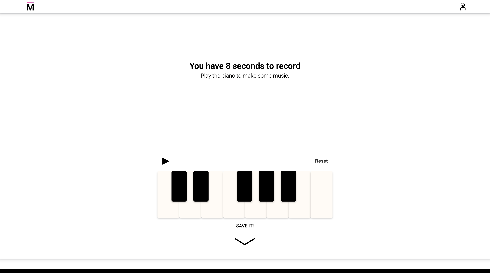

# <a href="https://museic-demo.herokuapp.com/"></a> Museic - a social musical snippet app
**[Museic](https://museic-demo.herokuapp.com/ "Go to Museic")** is a social platform with a unique UI to record and share short melodies.

## Table of contents
* [General Info](#general-info)
* [Technologies](#technologies)
* [Developers](#developers)
* [Features](#features)
  * [Interactive splash tutorial page](#interactive-splash-tutorial-page)
  * [Musical component](#musical-component)
  * [Accessible recording form in nav bar](#accessible-recording-form-in-nav-bar)
  * [Elegant snippet index and show pages](#elegant-snippet-index-and-show-pages)
  * [Front-end relational database queries on top of noSQL](#front-end-relational-database-queries-on-top-of-noSQL)
  * [AWS S3 media storage](#AWS-S3-media-storage)
<!-- * [Future Directions](#future-directions) -->

## General Info
You can't predict when and where you'll be inspired with the next great tune. When the muse strikes, jot down your melody ideas right away on [Museic](https://museic-demo.herokuapp.com/ "Go to Museic")! Use the intuitive and responsive piano keys UI to record your melody snippet right on the browser. Share your melody with everyone on Museic or save it as private to return to later.

## Technologies
* React/Redux
* Node
* Express
* MongoDB
* Tone.js
* AWS S3

## Developers
[Jenny / Jiani Fan](https://github.com/blueberry-hamster), [Jaehyuk Lee](https://github.com/jhlumd), and [Phil Zheng](https://github.com/Phil-1041)

## Features

---

### Interactive splash tutorial page

Our splash page walks new users through a curated journey from intro to creating an account. 
The steps are as follows:
1. Captivating animated name, and description of app.
2. Demonstration of what you can make on the app.
3. Having users create their own snippet, while learning how to use the musical component.
4. Asking for users to make an account with the incentive of saving their snippet.
5. The developers credit area.

---

### Musical Component


The input component is an octave of piano keys on the screen. It leverages Web Audio API and custom event listeners on each key to produce sound with the corresponding pitch for the duration of the mouse click.

The event listeners are also used to "record" user input (snippets) by keeping track of each individual input's pitch, relative start time, and duration. Then, the snippet is saved directly into the database as an array of musical note objects, each with those three pieces of information. This way, the "playback" of a snippet can be achieved by reproducing the sounds using only Web Audio API. This method eliminates the need for storage and retrieval of audio files.

The input component is paired with a display component that dynamically creates  visual representations of user input notes in real-time. This DOM manipulation was achieved using math with inline styling in React to create and position new elements to represent their duration and pitch visually like notes on sheet music.

```javascript
function SnippetBar(props) {
  const { pitch, startTime, duration } = props;
  let barTop;
  switch (pitch) {
    case "C6":
      barTop = 0;
      break;
    case "B5":
      barTop = 1;
      break;
    case "A#5":
      barTop = 2;
      break;
    case "A5":
      barTop = 3;
      break;
    case "G#5":
      barTop = 4;
      break;
    case "G5":
      barTop = 5;
      break;
    case "F#5":
      barTop = 6;
      break;
    case "F5":
      barTop = 7;
      break;
    case "E5":
      barTop = 8;
      break;
    case "D#5":
      barTop = 9;
      break;
    case "D5":
      barTop = 10;
      break;
    case "C#5":
      barTop = 11;
      break;
    case "C5":
      barTop = 12;
      break;
    default:
      barTop = 12;
      break;
  }

  const noteStyle = {
    top: (barTop / 13) * 100 + "%",
    left: (startTime / 32) * 100 + "%",
    width: (duration / 32) * 100 + "%"
  };

  return (<div className="single-note hvr-float" style={noteStyle}></div>);
}
```

---

### Accessible recording form in nav bar


We designed our app to have little between the user and the “create page”, by putting the create element in the navbar.
The nav is on every “page” when users are logged in.
Users don’t have to leave their current page to make a snippet.
A secondary route to the “create page” is in the dropdown.

---

### Elegant snippet index and show pages


The index and show have been elegantly combined into one page for a seamless user experience.
This layout allows users to quickly browse through snippets without having to worry about changing pages.
The limited information per snippet lends itself to a simpler design.
The look is unique and sleek.

---

### Front-end relational database queries on top of noSQL


The MongoDB database is a NoSQL program that operates without relational queries. As our application requires significant cross data type querying, we designed data retrieval to import all data from the backend to be processed on the frontend. Data is categorized and formatted to achieve the most efficiency, using hash objects at the higher levels to store array data types for easy iteration. This method integrates the speed of a NoSQL database with the usefulness of relational data queries, resulting in quick and responsive data processing.

---

### AWS S3 media storage


All images are hosted on Amazon Web Services (AWS). AWS integration was made through Multer S3, the streaming multer storage engine for AWS S3. The storage was facilitated using the express.js framework and Amazon’s SDK for AWS. 

---

<!-- ## Future Directions
*  Feature 1
*  Feature 2 -->
